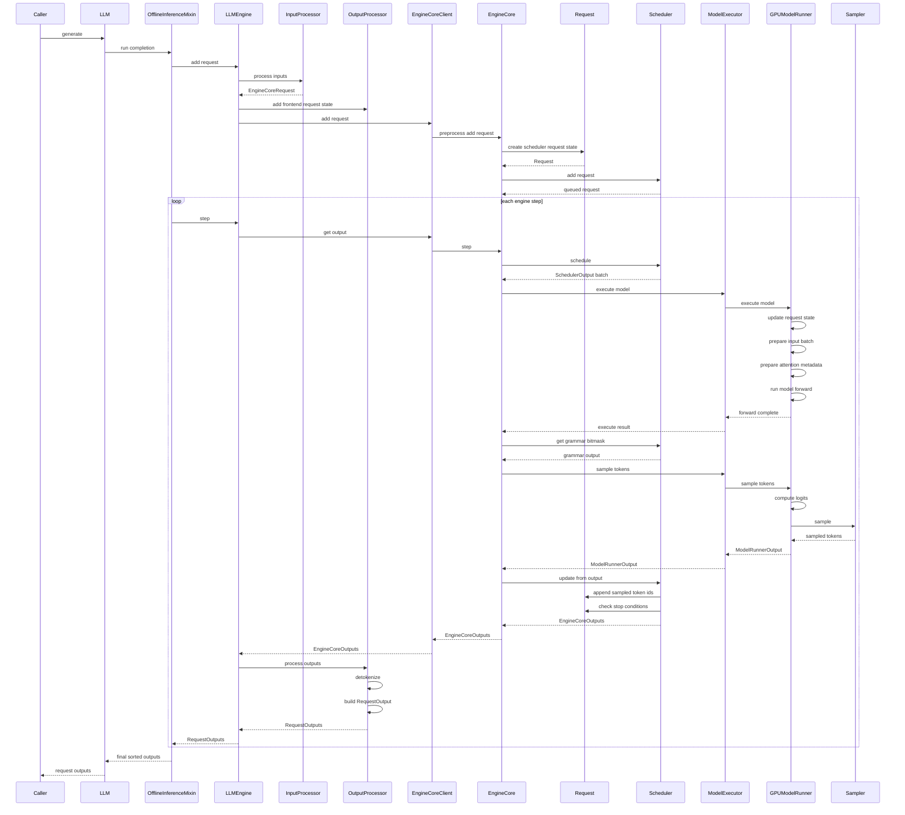
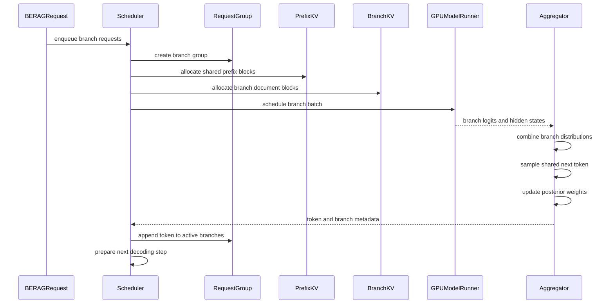

# vLLM Offline Eager Request Lifecycle

This file uses conservative Mermaid sequence-diagram syntax for compatibility
with older VS Code Mermaid preview extensions.

## Current vLLM Request Lifecycle

## BERAG Modification Pressure Points

